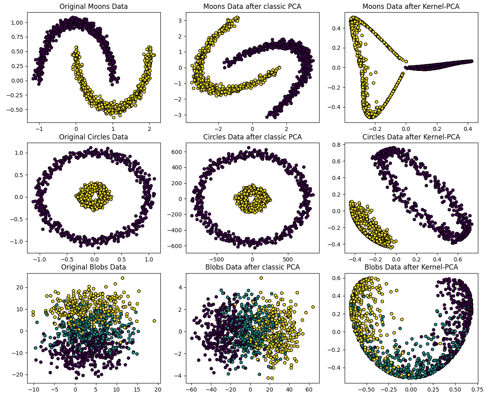
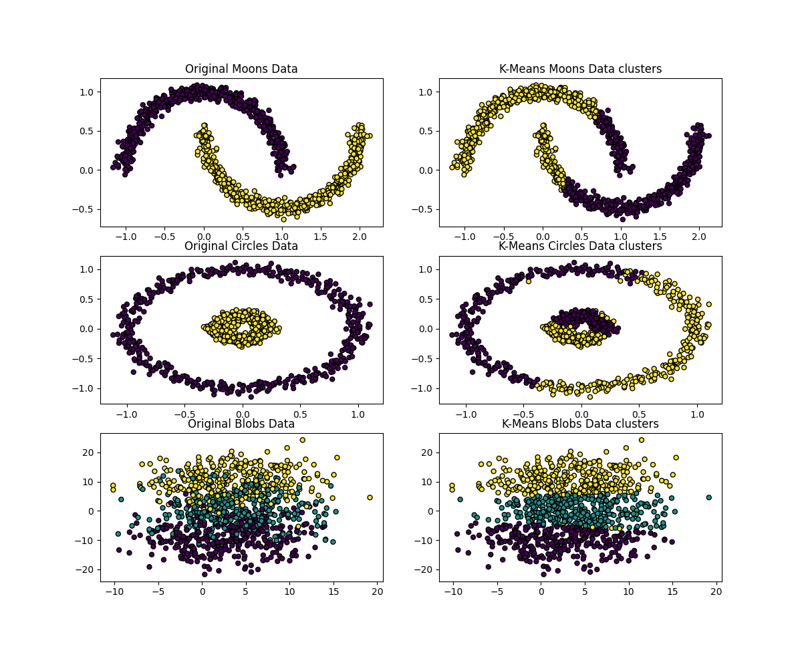
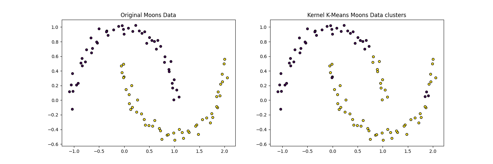

# Kernel Methods
This projects contains classical and kernelized versions of Principal Component Analysis (PCA) and K-Means clustering.

# List of Contents
1. [PCA](#pca)
2. [Kernel PCA](#kernel-pca)
3. [K-Means](#k-means)
4. [Kernel K-Means](#kernel-k-means)
5. [Available Kernels](#available-kernels)

## PCA
Principant Component Analysis or PCA is a dimensionality reduction technique that projects data into a lower (or equal) dimensional space while trying to keep the most information possible. It is mainly used to visualize and interpret datasets with large numbers of features.

The classical PCA method computes what we call the principal components of the data, which actually correspond to eigenvectors of its covariance matrix. The components with the highest explained variance are kept and use for performing the transformation on the original data.

## Kernel PCA

The steps for finding principal components with Kernel-PCA are the following:
1. Compute the gram matrix on the data with the given kernel function.
2. Center the gram matrix, having $1_N$ as a $nxn$ matrix filled with $1/n$ and $n$ as the number of data points.

$$ G_{centered} = G - 1_N \cdot G - G \cdot 1_N + 1_N \cdot G \cdot 1_N $$
  
4. Find the eigenvectors and eigenvalues on the centered gram matrix.
5. Perform the sign flip if needed.
6. Normalize the eigenvectors by the square root of their respective eigenvalues and these would make the new components.

## K-Means
K-means is a clustering algorithm that groups data points into clusters with the closest mean (centroid).

K-means is an algorithm with a large training time, since it requires calculating every point’s distance to every cluster centroid at each iteration, but with a low test time, since for a new point it only needs to calculate the distance of it to the cluster centroids.

The algorithm has two main phases: the assigment of the points’ labels and the update of the cluster centroids.

The clusters initialization can be done in three different ways:
- Randomly chosing already existing points in the data
- Generating points from a uniform distribution taking the minimum and maximum values present in the data
- Passing the centroids as a parameter

There are three different policies or strategies that can be followed to deal with an empty cluster during the execution of the algorithm:
- Use the previous cluster mean
- Add one randomly selected point from another cluster
- Removig that cluster and changing $k$ to $k-1$

## Kernel K-Means
In Kernel K-Means, it is important to remark three aspects in which the algorithm differs with regards to classical K-Means:
-  For the cluster initialization, there is no need to calculate cluster centroids, but just to randomly assign each point to one of the labels.
- Since the cluster centroids are not a mean of the member points as before but centers of mass, the assignment of a new label to a point will dynamically impact on the rest of the points’ assignments.
- The calculation of the distance from a point $i$ to a cluster $c$ is calculated through the following formula:

$$ d_{ic} = K(i, i) - \frac{2}{|c|} \sum_{j \in c} K(i, j) + \frac{1}{|c|^2} \sum_{j, l \in c} K(j, l) $$

## Available kernels
### Linear Kernel
$$ K(X, Y) = < X, Y > $$

### Polynomial kernel
$$ K(X, Y) = \gamma \cdot (<X, Y> + coef0)^{degree} $$

### Radial Basis Function (RBF) Kernel
$$ K(X, Y) = exp(- \gamma \cdot ||X - Y||^2) $$
